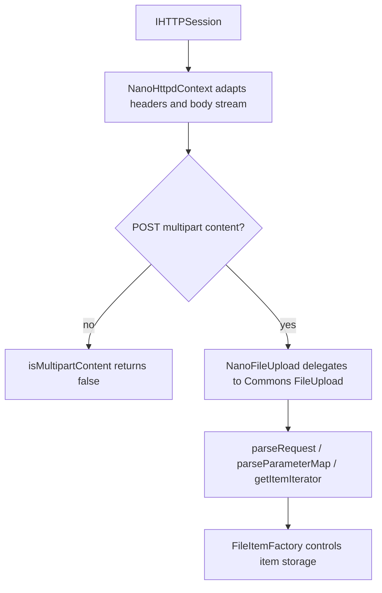

# File Upload Adapter Flow

```mermaid
flowchart TD
    A[IHTTPSession] --> B[NanoHttpdContext adapts headers and body stream]
    B --> C{POST multipart content?}
    C -- no --> D[isMultipartContent returns false]
    C -- yes --> E[NanoFileUpload delegates to Commons FileUpload]
    E --> F[parseRequest / parseParameterMap / getItemIterator]
    F --> G[FileItemFactory controls item storage]
```

Evidence: `NanoFileUpload.java:56-EOF`.
