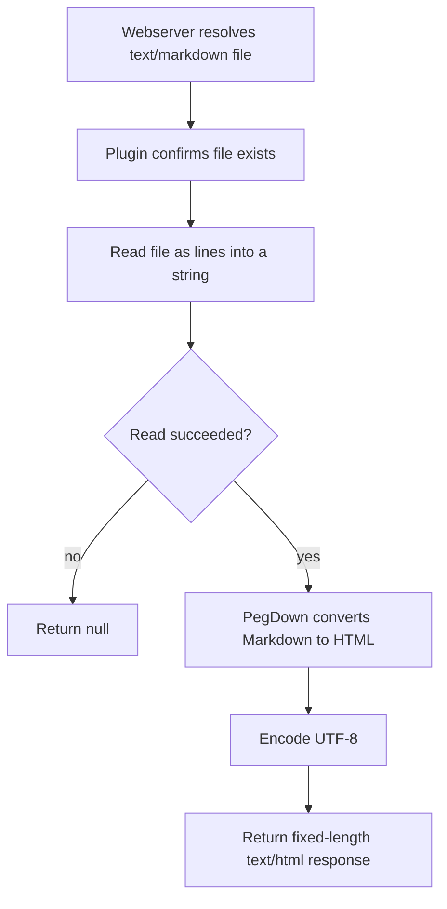

# Markdown Plugin Flow

```mermaid
flowchart TD
    A[Webserver resolves text/markdown file] --> B[Plugin confirms file exists]
    B --> C[Read file as lines into a string]
    C --> D{Read succeeded?}
    D -- no --> E[Return null]
    D -- yes --> F[PegDown converts Markdown to HTML]
    F --> G[Encode UTF-8]
    G --> H[Return fixed-length text/html response]
```

The plugin metadata advertises `text/markdown` and `index.md`. Evidence: `MarkdownWebServerPlugin.java:56-EOF`, `MarkdownWebServerPluginInfo.java`.
