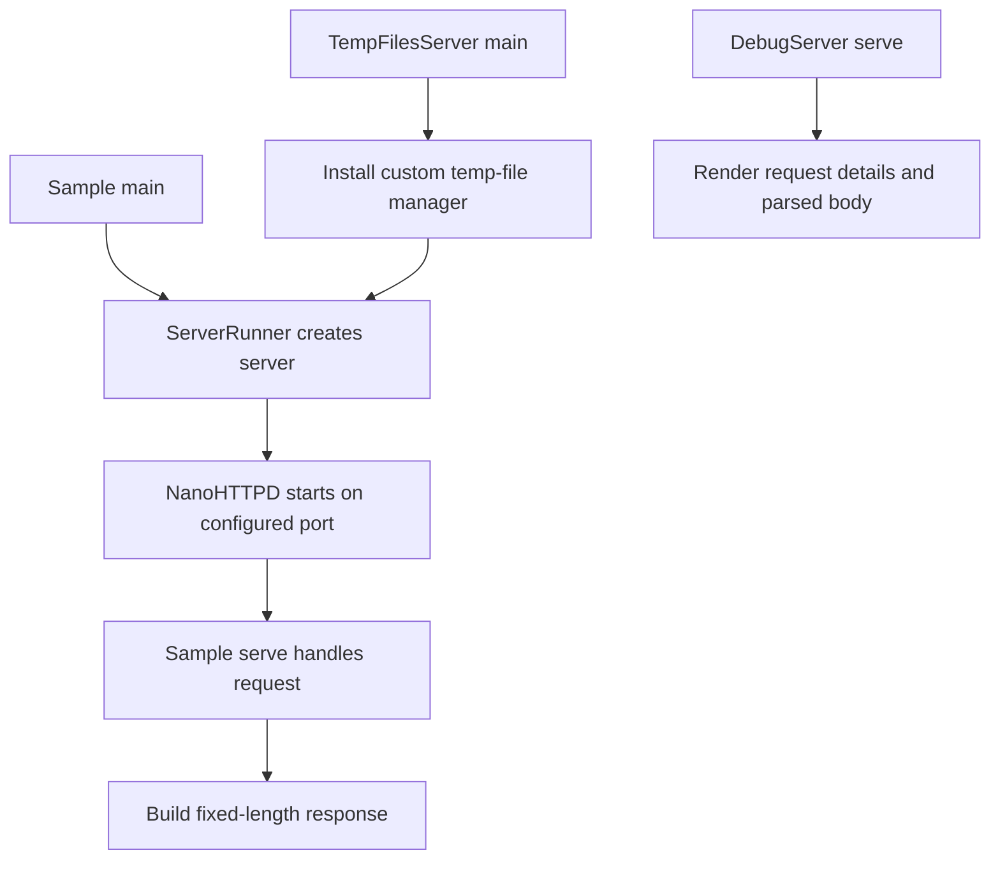

# Sample Server Flow

```mermaid
flowchart TD
    A[Sample main] --> B[ServerRunner creates server]
    B --> C[NanoHTTPD starts on configured port]
    C --> D[Sample serve handles request]
    D --> E[Build fixed-length response]
    F[TempFilesServer main] --> G[Install custom temp-file manager]
    G --> B
    H[DebugServer serve] --> I[Render request details and parsed body]
```

Evidence: `HelloServer.java`, `DebugServer.java`, and `TempFilesServer.java` in `samples/src/main/java/`.
