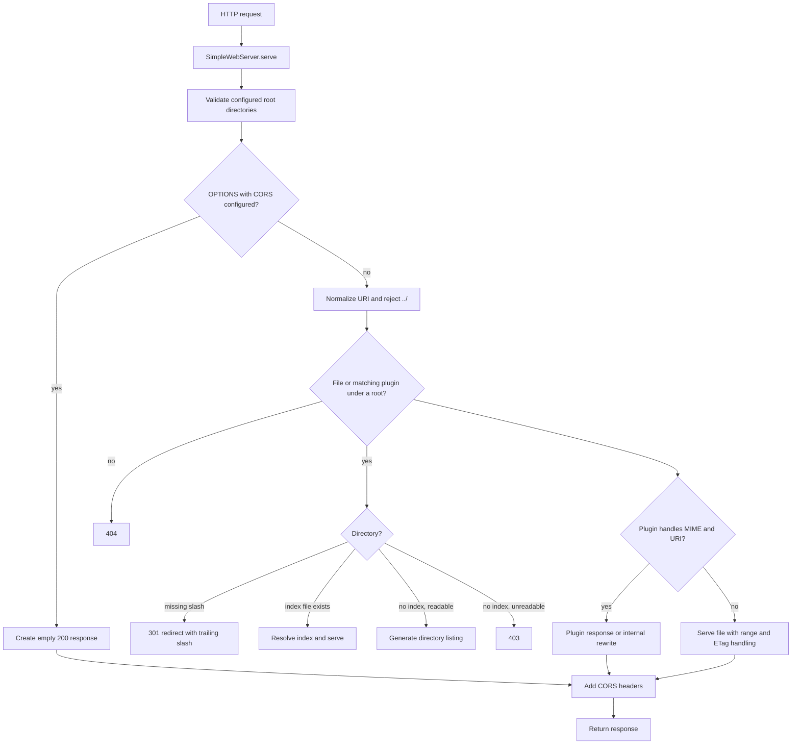

# Local Web Server Flow

```mermaid
flowchart TD
    A[HTTP request] --> B[SimpleWebServer.serve]
    B --> C[Validate configured root directories]
    C --> D{OPTIONS with CORS configured?}
    D -- yes --> E[Create empty 200 response]
    D -- no --> F[Normalize URI and reject ../]
    F --> G{File or matching plugin under a root?}
    G -- no --> H[404]
    G -- yes --> I{Directory?}
    I -- missing slash --> J[301 redirect with trailing slash]
    I -- index file exists --> K[Resolve index and serve]
    I -- no index, readable --> L[Generate directory listing]
    I -- no index, unreadable --> M[403]
    G --> N{Plugin handles MIME and URI?}
    N -- yes --> O[Plugin response or internal rewrite]
    N -- no --> P[Serve file with range and ETag handling]
    E --> Q[Add CORS headers]
    O --> Q
    P --> Q
    Q --> R[Return response]
```

Evidence: `SimpleWebServer.java:363-472,473-590`.
