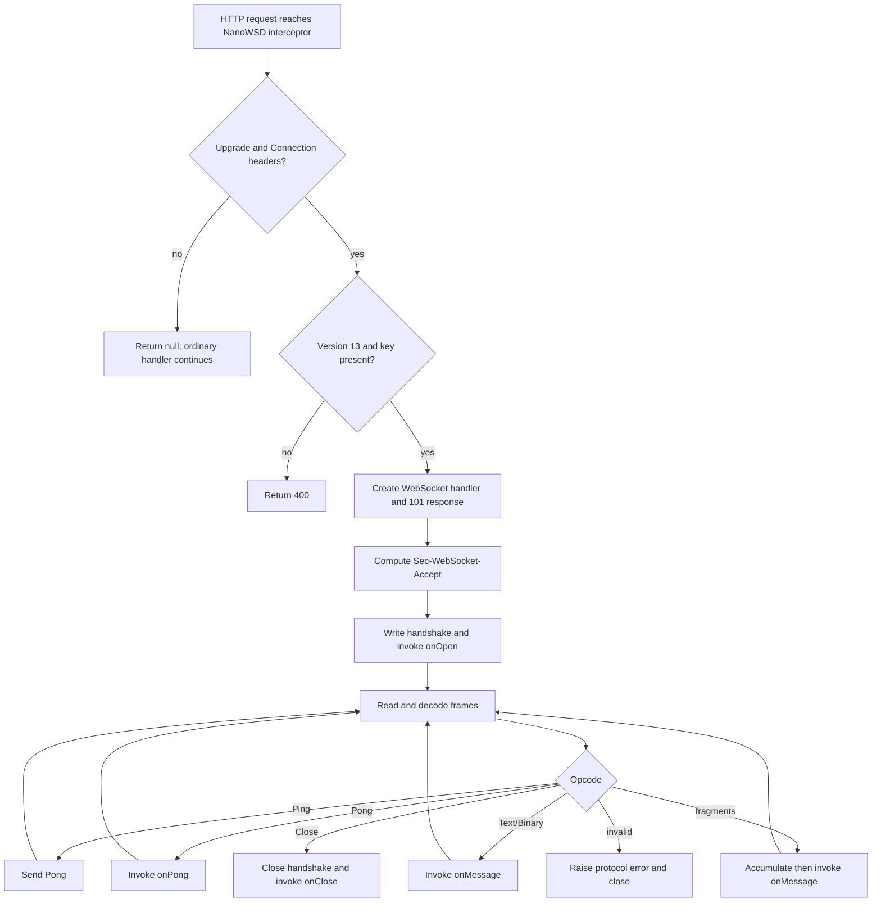

# WebSocket Module Flow

```mermaid
flowchart TD
    A[HTTP request reaches NanoWSD interceptor] --> B{Upgrade and Connection headers?}
    B -- no --> C[Return null; ordinary handler continues]
    B -- yes --> D{Version 13 and key present?}
    D -- no --> E[Return 400]
    D -- yes --> F[Create WebSocket handler and 101 response]
    F --> G[Compute Sec-WebSocket-Accept]
    G --> H[Write handshake and invoke onOpen]
    H --> I[Read and decode frames]
    I --> J{Opcode}
    J -- Ping --> K[Send Pong]
    J -- Pong --> L[Invoke onPong]
    J -- Text/Binary --> M[Invoke onMessage]
    J -- fragments --> N[Accumulate then invoke onMessage]
    J -- Close --> O[Close handshake and invoke onClose]
    J -- invalid --> P[Raise protocol error and close]
    K --> I
    L --> I
    M --> I
    N --> I
```

Evidence: `NanoWSD.java:142-197`, `WebSocket.java:48-76,161-223,248-257`, `WebSocketFrame.java:63-103,217-279`.
